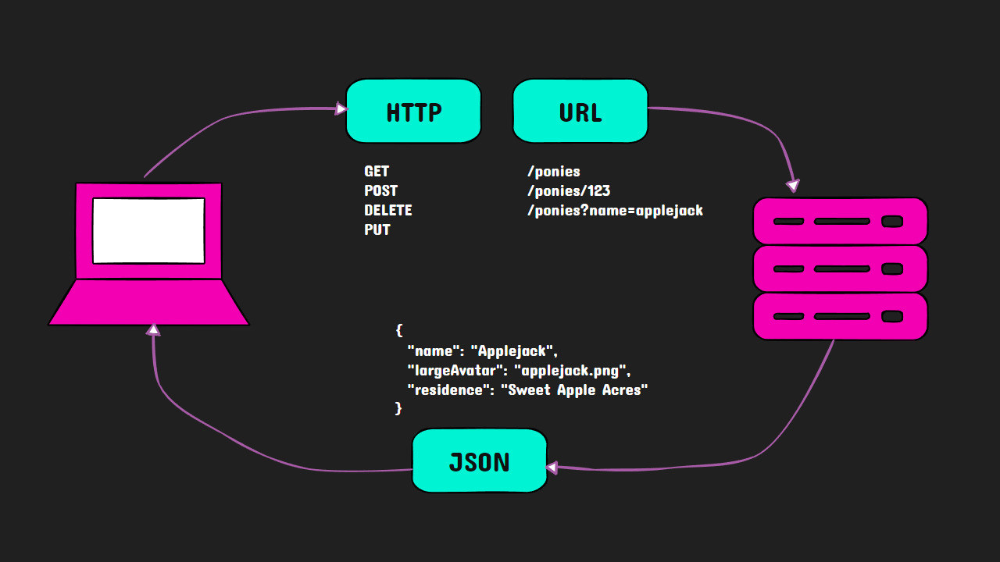

+++
archetype = "chapter"
title = "What is a RESTful API?"
weight = 1
chapter= 3.1
+++

**REST** stands for **RE**presentational **S**tate **T**ransfer and is an architectural style for designing networked applications. It relies on a stateless, client-server, cacheable communications protocol -- typically, the HTTP protocol. 

RESTful systems, such as web services, use HTTP requests to perform CRUD operations (Create, Read, Update, Delete) on resources, where each resource is identified by a URL.

A RESTful API is a set of HTTP endpoints that leverage standard HTTP methods and principles to enable communication between clients and servers. RESTful APIs are stateless, meaning each request from a client to a server must contain all the information needed to understand and process the request. They also promote a uniform interface, simplifying and decoupling the architecture for improved scalability and portability.

